<picture>
  <source media="(prefers-color-scheme: dark)" srcset="./assets/terminal-dark.svg">
  <source media="(prefers-color-scheme: light)" srcset="./assets/terminal-light.svg">
  
</picture>

<div align="center">
  <strong>DevOps Engineer · Full-Stack Developer</strong><br>
  Automação · Integrações · Infraestrutura · Observabilidade
</div>

<br>

## `augusto@devops:~$ cat about.md`

Sou **Augusto Silva**, profissional de **DevOps e desenvolvimento Full-Stack**. Trabalho na construção de plataformas internas, APIs, integrações e automações, acompanhando o software desde o levantamento de requisitos e modelagem dos dados até a implantação, o monitoramento e a manutenção em produção.

Meu foco é transformar necessidades operacionais em sistemas confiáveis, escaláveis e fáceis de manter — reduzindo trabalho manual, conectando serviços e criando visibilidade sobre o que acontece em cada etapa da operação.

```text
status  : construindo soluções para problemas reais de negócio
focus   : automação, arquitetura, cloud e observabilidade
method  : code → build → deploy → monitor → improve
```

## `augusto@devops:~$ ls -la ./work`

| Diretório | O que desenvolvo |
|---|---|
| `applications/` | Aplicações web responsivas, interfaces administrativas e experiências internas com React e Next.js. |
| `apis/` | APIs REST, autenticação, regras de negócio, filas e integrações com sistemas externos. |
| `platforms/` | CRMs, dashboards, gestão de colaboradores e ferramentas para processos empresariais. |
| `automation/` | Rotinas que criam tarefas, sincronizam dados, eliminam etapas manuais e conectam operações. |
| `infrastructure/` | Containers, proxy reverso, processos, pipelines de CI/CD e implantação em servidores Linux. |
| `observability/` | Logs, monitoramento, diagnóstico de falhas e melhoria contínua da confiabilidade. |

## `augusto@devops:~$ ./pipeline --mode production`

```text
[ CODE    ] Git · TypeScript · JavaScript · React · Node.js
     │
[ BUILD   ] validações · testes · dependências · modelagem de dados
     │
[ DEPLOY  ] Docker · Docker Compose · GitHub Actions · Nginx · PM2
     │
[ MONITOR ] Linux · logs · Zabbix · análise de erros · manutenção
     │
[ IMPROVE ] automação · segurança · desempenho · escalabilidade
```

## `augusto@devops:~$ cat /etc/stack.conf`

```ini
[frontend]
frameworks = React, Next.js
language = TypeScript, JavaScript
ui = Tailwind CSS
state = React Query, Zustand

[backend]
runtime = Node.js
frameworks = NestJS, Express
orm = Prisma
security = JWT
queues = BullMQ
interfaces = REST APIs

[data]
databases = PostgreSQL, MySQL
cache = Redis
storage = AWS S3

[devops]
containers = Docker, Docker Compose
ci_cd = GitHub Actions
proxy = Nginx
process_manager = PM2
operating_system = Linux

[tooling]
version_control = Git, GitHub
testing = Playwright
api_client = Postman
monitoring = Zabbix
design = Figma
```

## `augusto@devops:~$ find ./projects -maxdepth 2 -type f`

### [`./public/conecta-sus`](https://github.com/GuguPx/conecta-sus)

Aplicação web em React e TypeScript voltada à apresentação de serviços e conteúdos relacionados à saúde pública.

```text
features : interface responsiva, quiz com pontuação, busca e paginação
state    : Zustand
motion   : Framer Motion
stack    : React, TypeScript, Vite, Tailwind CSS
```

### `./enterprise/internal-platforms`

Experiência na construção de sistemas internos para:

- gestão de leads, prospecções e negociações;
- recursos humanos e gestão de colaboradores;
- integrações com sistemas ERP;
- automação de atendimentos e tarefas;
- dashboards operacionais e gerenciais;
- centralização de logs e monitoramento;
- pipelines de implantação e atualização.

## `augusto@devops:~$ tail -f learning.log`

```text
[active] arquitetura de software
[active] design patterns
[active] segurança de aplicações
[active] observabilidade
[active] cloud e infraestrutura
[active] testes automatizados
[active] desenvolvimento mobile
```

## `augusto@devops:~$ echo $GOAL`

> Continuar evoluindo em DevOps e desenvolvimento Full-Stack, aprofundando conhecimentos em arquitetura, automação, cloud e observabilidade para entregar aplicações cada vez mais seguras, escaláveis e sustentáveis.

<div align="center">
  <sub>Built as code. Shipped with automation. Monitored in production.</sub>
</div>
